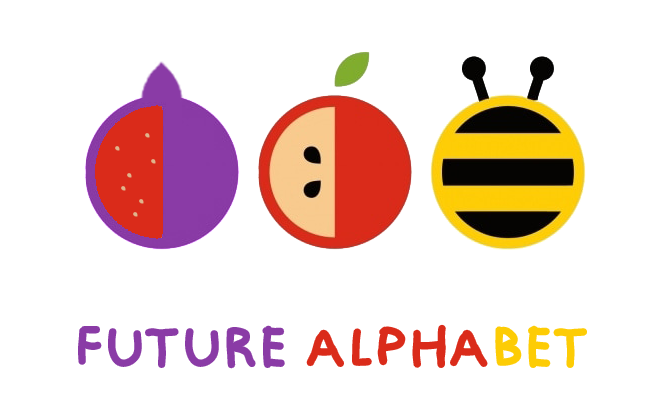
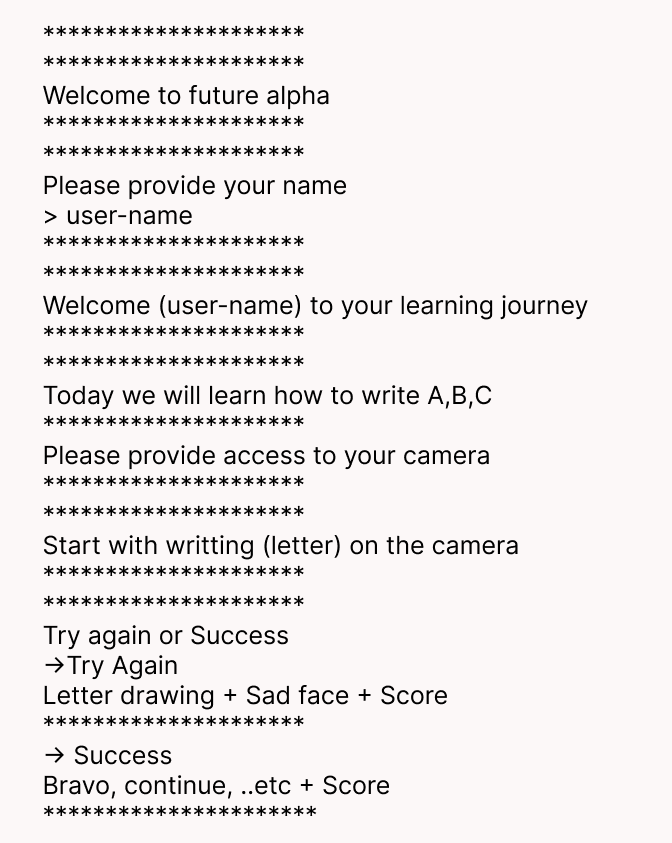

# Future Alphabet

### Group Members:

- Raghad Abdulhadi
- Emad Almajdalawi
- Suhaib Ahmad
- Ghaida Momany
- Moayad AbuKhadra

### Future Alphabet Project Description:

Teach kids how to write letters in the proper format using a virtual mouse (camera that detects the user's hand gestures using computer vision and artificial intelligence), we can use the following libraries:

    OpenCV: for image processing and drawing
    mediapipe: for hand tracking 
    autopy: for controlling the mouse movement and click 

#### Stretch goals:

- The data is then gathered and analyzed to determine the most common errors made by each user so that the program can pay more attention to it and teach it to that child more intensively. Finally, offer each user data that can be visualized (e.x matplotlib).
- Voice recognition could be added for pronunciation of the letters (e.x apiai, or google-cloud-speech).
- Provide words that start with each letter as an example.

#### WireFrame:
